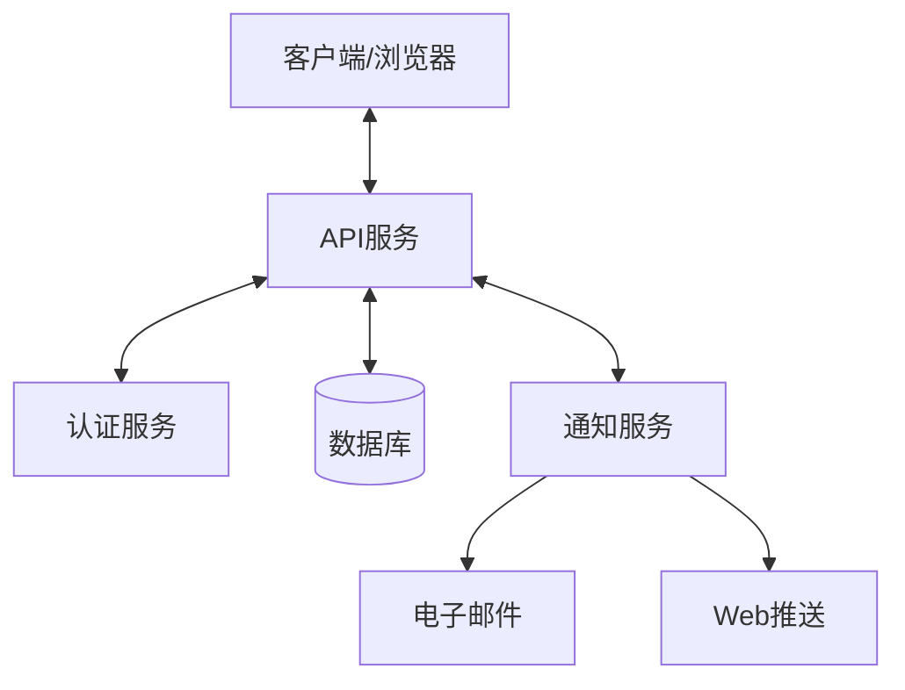
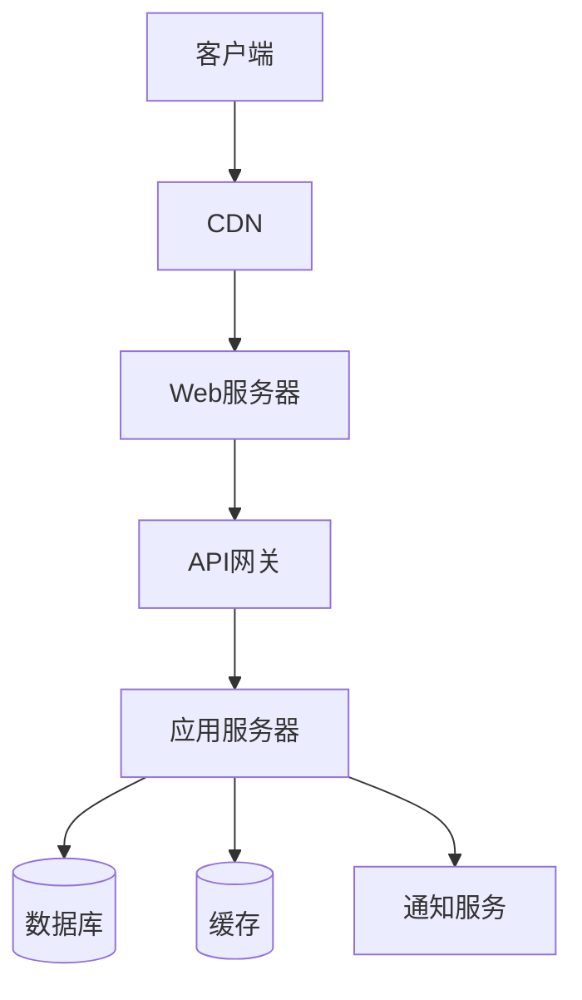

# 设计文档：化疗血常规追踪器

## 概述

化疗血常规追踪器是一个响应式网页应用，专为化疗患者设计，用于记录、追踪和分析化疗期间的血常规检查结果。该应用采用现代化的前端框架和安全的后端架构，确保数据的安全性和用户体验的流畅性。

## 架构

系统采用前后端分离的架构设计，具体如下：



### 前端架构

前端采用单页应用（SPA）架构，使用React框架实现，主要组件包括：

1. **用户界面层**：包含所有视图组件，如登录页面、仪表板、数据输入表单、图表展示等。
2. **状态管理层**：使用Redux或Context API管理应用状态。
3. **服务层**：处理与后端API的通信，包括数据获取、提交等。
4. **工具层**：包含辅助功能，如数据格式化、验证等。

### 后端架构

后端采用RESTful API设计，使用Node.js和Express框架实现，主要组件包括：

1. **API控制器**：处理前端请求，实现业务逻辑。
2. **认证中间件**：验证用户身份和权限。
3. **数据访问层**：与数据库交互，执行CRUD操作。
4. **通知服务**：处理提醒和通知的发送。

### 数据库设计

系统使用MongoDB作为主数据库，存储用户信息、血常规数据和化疗周期信息。

## 组件和接口

### 前端组件

1. **认证组件**
   - 登录表单
   - 注册表单
   - 密码重置表单

2. **仪表板组件**
   - 概览面板：显示最近的血常规数据和关键指标
   - 快速添加按钮：快速添加新的血常规记录
   - 提醒列表：显示即将到来的检查和提醒

3. **数据记录组件**
   - 血常规数据输入表单
   - 化疗周期管理表单
   - 数据列表视图

4. **数据可视化组件**
   - 时间序列图表：显示血液指标随时间的变化
   - 比较图表：对比不同时期的数据
   - 异常标记：突出显示异常值

5. **设置组件**
   - 用户资料设置
   - 提醒设置
   - 数据共享设置

### 后端API接口

#### 用户认证API

```
POST /api/auth/register - 用户注册
POST /api/auth/login - 用户登录
POST /api/auth/reset-password - 重置密码
GET /api/auth/profile - 获取用户资料
PUT /api/auth/profile - 更新用户资料
```

#### 血常规数据API

```
GET /api/blood-tests - 获取血常规记录列表
GET /api/blood-tests/:id - 获取单个血常规记录详情
POST /api/blood-tests - 创建新的血常规记录
PUT /api/blood-tests/:id - 更新血常规记录
DELETE /api/blood-tests/:id - 删除血常规记录
```

#### 化疗周期API

```
GET /api/chemo-cycles - 获取化疗周期列表
GET /api/chemo-cycles/:id - 获取单个化疗周期详情
POST /api/chemo-cycles - 创建新的化疗周期
PUT /api/chemo-cycles/:id - 更新化疗周期
DELETE /api/chemo-cycles/:id - 删除化疗周期
```

#### 提醒API

```
GET /api/reminders - 获取提醒列表
POST /api/reminders - 创建新提醒
PUT /api/reminders/:id - 更新提醒
DELETE /api/reminders/:id - 删除提醒
```

#### 数据分析API

```
GET /api/analytics/trends - 获取血常规趋势数据
GET /api/analytics/summary - 获取数据摘要统计
GET /api/analytics/export - 导出数据
```

## 数据模型

### 用户模型 (User)

```json
{
  "_id": "ObjectId",
  "email": "String",
  "passwordHash": "String",
  "firstName": "String",
  "lastName": "String",
  "dateOfBirth": "Date",
  "gender": "String",
  "createdAt": "Date",
  "updatedAt": "Date",
  "settings": {
    "notifications": {
      "email": "Boolean",
      "push": "Boolean"
    },
    "dataSharing": {
      "enabled": "Boolean",
      "sharedWith": ["String"]
    }
  }
}
```

### 血常规记录模型 (BloodTest)

```json
{
  "_id": "ObjectId",
  "userId": "ObjectId",
  "testDate": "Date",
  "chemoCycleId": "ObjectId",
  "values": {
    "wbc": "Number",
    "rbc": "Number",
    "hgb": "Number",
    "plt": "Number",
    "neu": "Number",
    "lym": "Number",
    "other": {
      "key": "value"
    }
  },
  "notes": "String",
  "createdAt": "Date",
  "updatedAt": "Date"
}
```

### 化疗周期模型 (ChemoCycle)

```json
{
  "_id": "ObjectId",
  "userId": "ObjectId",
  "startDate": "Date",
  "endDate": "Date",
  "medications": [{
    "name": "String",
    "dosage": "String",
    "schedule": "String"
  }],
  "doctorNotes": "String",
  "createdAt": "Date",
  "updatedAt": "Date"
}
```

### 提醒模型 (Reminder)

```json
{
  "_id": "ObjectId",
  "userId": "ObjectId",
  "type": "String",
  "title": "String",
  "description": "String",
  "date": "Date",
  "isRecurring": "Boolean",
  "recurrencePattern": "String",
  "isCompleted": "Boolean",
  "createdAt": "Date",
  "updatedAt": "Date"
}
```

## 错误处理

系统将实现全面的错误处理机制，包括：

1. **前端错误处理**
   - 表单验证错误：在用户提交前验证输入
   - API错误处理：优雅地处理后端API错误
   - 网络错误处理：处理网络连接问题

2. **后端错误处理**
   - 请求验证错误：验证所有API请求参数
   - 业务逻辑错误：处理业务规则违反情况
   - 数据库错误：处理数据库操作失败
   - 认证错误：处理未授权访问

3. **错误日志**
   - 前端错误日志：记录客户端错误
   - 后端错误日志：记录服务器端错误
   - 错误监控：实时监控系统错误

## 安全策略

1. **认证与授权**
   - JWT (JSON Web Token) 认证
   - 基于角色的访问控制
   - 会话超时机制

2. **数据安全**
   - 数据传输加密 (HTTPS)
   - 数据存储加密 (敏感字段)
   - 密码哈希存储 (bcrypt)

3. **API安全**
   - 请求速率限制
   - CSRF保护
   - 输入验证和消毒

4. **合规性**
   - 符合健康数据保护法规
   - 用户数据删除机制
   - 数据访问审计日志

## 测试策略

1. **单元测试**
   - 前端组件测试：使用Jest和React Testing Library
   - 后端服务测试：使用Mocha和Chai

2. **集成测试**
   - API端点测试：验证API功能
   - 数据流测试：验证数据流程

3. **端到端测试**
   - 用户流程测试：使用Cypress模拟用户操作
   - 跨浏览器测试：确保跨浏览器兼容性

4. **性能测试**
   - 负载测试：验证系统在高负载下的表现
   - 响应时间测试：确保系统响应迅速

## 部署架构

系统将采用云服务部署，具体架构如下：



1. **前端部署**
   - 静态资源托管在CDN
   - 自动化构建和部署流程

2. **后端部署**
   - 容器化部署 (Docker)
   - 水平扩展能力
   - 负载均衡

3. **数据库部署**
   - 主从复制
   - 自动备份
   - 数据恢复机制

## 用户界面设计

### 配色方案

应用将使用柔和、专业的配色方案，主要包括：

- 主色调：#4A90E2（平静蓝）
- 辅助色：#50E3C2（薄荷绿）
- 警告色：#F5A623（温和橙）
- 错误色：#D0021B（柔和红）
- 背景色：#F8F9FA（浅灰白）

### 主要页面布局

1. **登录/注册页面**
   - 简洁的表单设计
   - 清晰的导航选项

2. **仪表板页面**
   - 顶部导航栏
   - 侧边菜单
   - 主内容区域（概览、图表、最近记录）

3. **数据记录页面**
   - 直观的表单布局
   - 分步骤输入（对于复杂数据）

4. **数据可视化页面**
   - 大型图表区域
   - 过滤和时间范围选择器
   - 图例和说明

5. **设置页面**
   - 分类设置选项
   - 清晰的保存/取消操作

### 响应式设计

应用将实现完全响应式设计，适应不同屏幕尺寸：

- 桌面布局（>1024px）：全功能界面
- 平板布局（768px-1024px）：优化的导航和布局
- 移动布局（<768px）：简化界面，触摸友好的控件

## 技术栈

### 前端技术

- **框架**：React.js
- **状态管理**：Redux或Context API
- **路由**：React Router
- **UI组件库**：Material-UI或Ant Design
- **图表库**：Chart.js或D3.js
- **HTTP客户端**：Axios
- **表单处理**：Formik + Yup

### 后端技术

- **运行时**：Node.js
- **框架**：Express.js
- **认证**：Passport.js + JWT
- **数据库ORM**：Mongoose
- **验证**：Joi或express-validator
- **日志**：Winston
- **任务队列**：Bull（用于通知处理）

### 数据库

- **主数据库**：MongoDB
- **缓存**：Redis（用于会话和频繁访问数据）

### 开发工具

- **包管理**：npm或Yarn
- **构建工具**：Webpack
- **代码质量**：ESLint + Prettier
- **测试**：Jest, Mocha, Cypress
- **CI/CD**：GitHub Actions或Jenkins

## 性能考虑

1. **前端性能优化**
   - 代码分割和懒加载
   - 资源压缩和缓存
   - 图片优化

2. **后端性能优化**
   - 数据库索引优化
   - 查询优化
   - 缓存策略

3. **移动设备优化**
   - 减少网络请求
   - 优化图表渲染
   - 离线功能支持

## 可访问性

应用将遵循WCAG 2.1 AA级别的可访问性标准，包括：

1. 适当的颜色对比度
2. 键盘导航支持
3. 屏幕阅读器兼容性
4. 文本替代方案（对于图表和图像）
5. 可调整的文本大小

## 国际化和本地化

系统将支持多语言，初始支持中文，后续可扩展支持其他语言。国际化实现将使用i18next或类似库。

## 扩展性考虑

1. **模块化设计**：系统采用模块化设计，便于添加新功能
2. **API版本控制**：API接口支持版本控制，便于未来升级
3. **插件架构**：支持通过插件扩展系统功能
4. **第三方集成**：预留与医院系统或其他健康应用集成的接口