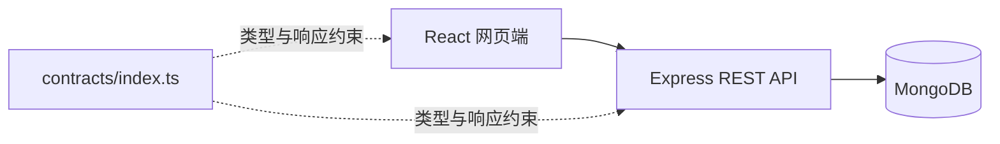
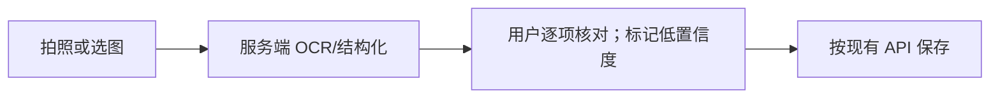
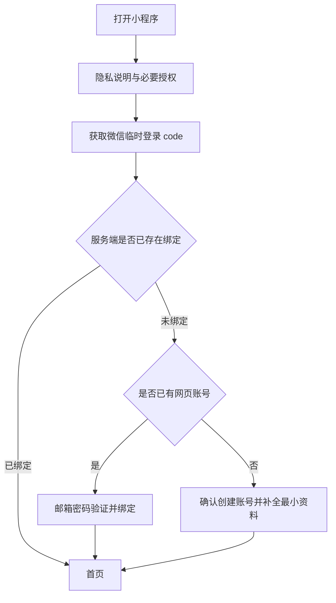
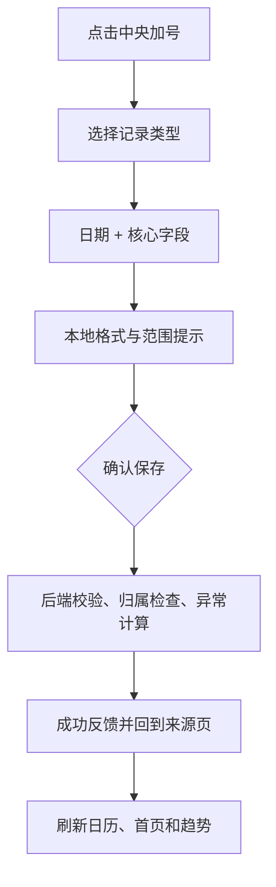
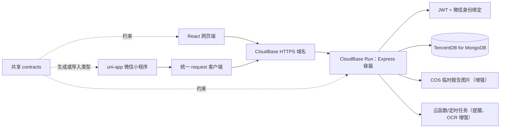
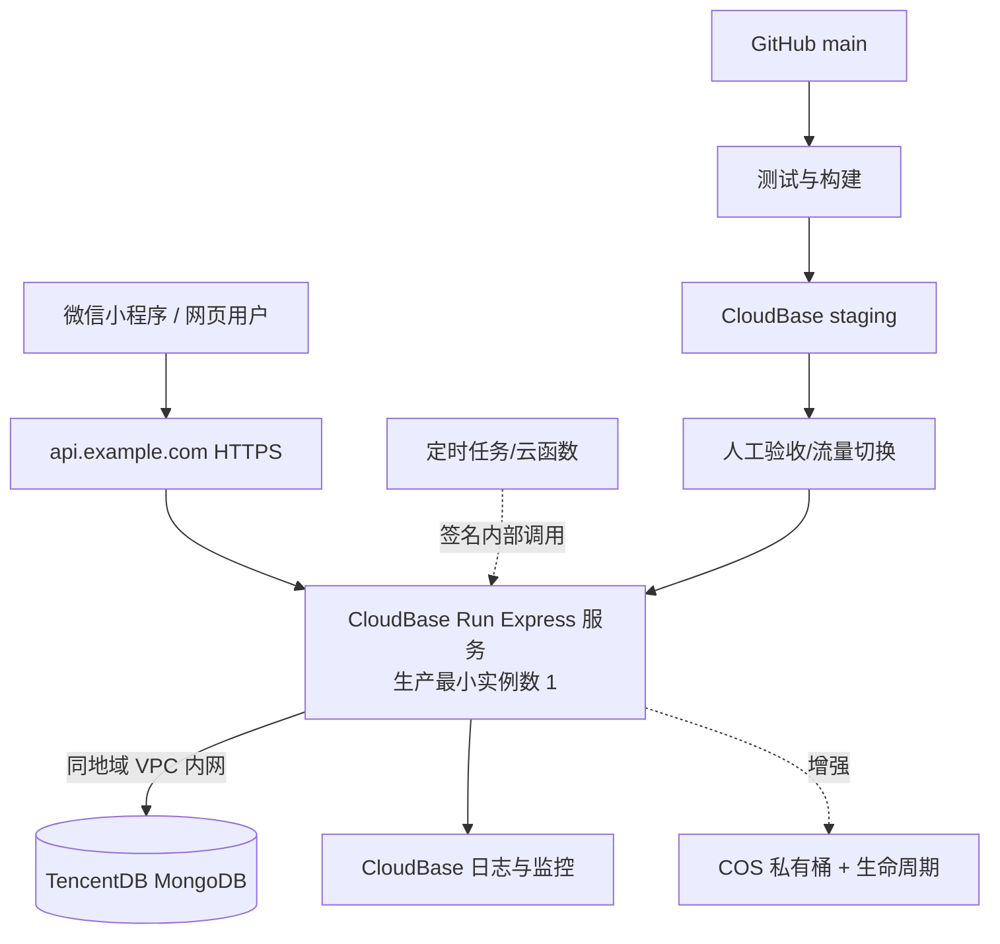

# BloodTrack 微信小程序（uni-app）项目规划与开发文档

> 文档状态：评审整理版，可用于立项、排期和开发启动
>
> 编写日期：2026-07-19
>
> 适用对象：产品负责人、设计、前后端开发、测试、部署与运营人员
>
> 依据：当前 `frontend`、`backend`、`contracts` 代码，以及 `miniapp sample` 中 6 张参考截图

## 1. 文档目的

本文档定义如何把现有 BloodTrack 网页版迁移为微信小程序，并保持两端业务逻辑、数据和安全策略一致。它同时回答以下问题：

1. 哪些网页版能力必须迁移，哪些应调整为更适合手机和微信的交互。
2. 哪些后端和共享代码可以复用，哪些接口必须新增或改造。
3. 参考小程序截图中哪些设计值得采纳，分别放在哪个版本实现。
4. uni-app 项目的目录、页面、状态管理、请求层、认证、测试与发布方式如何设计。
5. 项目应如何分阶段交付，以及每个阶段怎样验收。

本文档不是医学诊疗规范。指标参考范围、异常提示和健康建议在正式发布前仍需由具备资质的医学人员审核。

## 2. 项目结论

### 2.1 推荐方案

新增独立的 `miniapp/` 客户端，采用：

- uni-app（Vue 3）
- TypeScript 严格模式
- Vite/CLI 工程
- Pinia 状态管理
- `uni.request` 封装统一请求层
- SCSS + 项目自有设计令牌
- 微信小程序作为首个且主要发布目标
- Tencent CloudBase Run 托管现有 Express 容器
- TencentDB for MongoDB 托管业务数据库

现有 Express + MongoDB 继续作为唯一业务后端，但部署方式从“自管服务器/Docker Compose”调整为“微信生态托管容器 + 托管数据库”。现有 `contracts/index.ts` 继续作为接口数据契约基准。网页版和小程序共享账号、血常规、生化、化疗周期、提醒、分享和分析数据。

这一方案兼顾两点：一方面使用小程序主流的 CloudBase 托管能力，减少服务器、证书、扩缩容和日志运维；另一方面不重写已经通过测试的 Express、Mongoose、JWT 和数据隔离逻辑，也不影响现有网页版继续使用同一套 REST API。

### 2.2 不采用“直接转换 React 代码”的原因

React DOM、React Router、CSS 页面布局、Axios 拦截器和 Chart.js 不能可靠地直接转换成微信小程序组件。应复用的是：

- 数据模型和 TypeScript 契约
- REST API
- 正常范围与异常判定规则
- 日期、趋势和骨髓抑制期等纯业务算法
- 多语言文案的语义和 key
- 自动化测试中的业务场景

页面与交互层应按移动端重新实现，而不是逐行翻译 React 组件。

### 2.3 首发范围建议

首发版本目标是“功能等价 + 微信端体验优化”，包含：

- 微信快捷登录，并能绑定既有邮箱账号
- 首页健康概览
- 记录日历
- 中央“加一笔”快捷入口
- 血常规、生化、化疗周期的增删改查
- 异常值提示与趋势图
- 提醒管理
- 只读分享
- 个人资料、语言、安全与注销

扫描报告录入、微信订阅消息和家庭成员共同管理建议作为首发后的增强版本；首版可先保留入口说明或灰度开关，但不应以半成品状态发布。

## 3. 当前系统盘点

### 3.1 当前架构



网页版已经具备以下模块：

| 模块 | 当前能力 | 小程序处理方式 |
|---|---|---|
| 账号 | 注册、登录、刷新令牌、退出、忘记/重置密码 | 保留邮箱登录；新增微信登录与账号绑定 |
| 首页 | 血检总数、最新日期、异常数、最近记录、近期提醒 | 重构为卡片化概览和快捷入口 |
| 血常规 | WBC、RBC、HGB、PLT、NEU、LYM、备注、周期关联 | 完整迁移，优化为数字键盘和分步录入 |
| 生化 | 肝功能、肾功能、电解质等 25 项 | 完整迁移，按类别折叠，支持常用字段偏好 |
| 化疗周期 | 方案、起止日期、药物、剂量、备注 | 完整迁移，并显示在日历与趋势背景中 |
| 分析 | 血常规/生化趋势、正常上下限、异常点、骨髓抑制期提示 | 重做移动图表和分组趋势卡片 |
| 提醒 | 类型、时间、重复、完成、启停 | 完整迁移；后续接微信订阅消息 |
| 分享 | 范围、有效期、PIN、撤销、公开只读页 | 接入微信转发卡片和小程序路径 |
| 设置 | 资料、语言、通知、改密、审计、删号 | 重组为“我的”页面和二级设置页 |
| 安全 | JWT、刷新、注销失效、限流、审计、数据隔离 | 原样继承并增加微信身份与设备会话管理 |

### 3.2 现有 API 可复用范围

下列接口原则上无需改变业务语义，小程序只需使用新的请求适配层调用：

- `/api/auth/*`
- `/api/blood-tests/*`
- `/api/biochem-tests/*`
- `/api/chemo-cycles/*`
- `/api/analytics/*`
- `/api/reminders/*`
- `/api/shares/*`
- `/api/public/shares/*`

已有接口的所有权校验、异常值计算、分享范围校验必须继续放在后端。小程序端的校验只负责即时反馈，不能成为唯一安全边界。

### 3.3 当前后端缺口

小程序开发前需要明确以下缺口：

1. 目前没有微信 `code -> openid` 登录与账号绑定接口。
2. 提醒有数据模型和 CRUD，但没有可确认的定时调度与微信订阅消息发送链路。
3. 当前分享是公开链接/PIN 模型，不等同于家庭成员长期协作授权。
4. 当前没有检验报告图片上传、OCR、识别结果校对和图片生命周期管理。
5. 首页和日历若沿用多个列表接口，会产生额外请求；建议增加聚合接口。
6. 正常范围在共享契约、前端和后端存在重复定义，后续应收敛为单一来源。

## 4. 参考截图分析与采纳决策

### 4.1 截图识别出的主要设计

| 截图 | 设计要点 | BloodTrack 采纳方式 |
|---|---|---|
| `微信图片_...33...jpg` 首页 | 分组趋势卡片、时间筛选、卡片内快捷新增、中央加号 | 采纳趋势卡片和快捷新增；首页信息改为当前系统指标 |
| `微信图片_...34...jpg` 记录页 | 月历、治疗阶段标签、日期事件标记、当天记录列表 | 作为小程序核心页面完整采纳 |
| `加一笔1.jpg` | 底部半屏快捷面板，多种记录类型图标化入口 | 采纳；首版入口为血常规、生化、化疗周期、提醒 |
| `加一笔2.jpg` | 手工/扫描双入口、日期优先、默认核心字段、可添加更多字段 | 采纳交互结构；扫描作为增强版本 |
| `微信图片_...35...jpg` 看板 | 综合/报告/用药分栏、时间范围、表格/分享等工具 | 采纳综合趋势与时间筛选；不照搬无数据价值的空分栏 |
| `微信图片_...36...jpg` 我的 | 微信用户、档案、分享、帮助、联系 | 与现有资料、分享、安全设置合并 |

### 4.2 值得加入的创意

#### A. 记录日历（首发）

把血常规、生化检查和化疗周期统一投射到月历：

- 绿点：化疗周期/治疗日
- 红点：存在异常检验结果
- 蓝点：普通检验记录
- 橙点：提醒或复诊
- 同一天多事件时使用组合点，不用整格铺满颜色

点击日期后在下方展示当日记录。用户可从日历直接编辑或新增，减少在多个列表之间切换。

#### B. 中央“加一笔”（首发）

底部中央加号不是一个页面，而是全局动作。点击后弹出半屏面板：

1. 血常规
2. 生化检查
3. 化疗周期
4. 提醒

按最近使用频率排序可作为后续优化；首版保持固定顺序，避免入口漂移。

#### C. 核心字段 + 更多字段（首发）

血常规默认显示 WBC、NEU、HGB、PLT，RBC、LYM 放在“更多指标”中；但历史记录与接口仍保存完整字段。生化检查按肝功能、肾功能、电解质、其他分组折叠，并记住用户最近展开的分组。

#### D. 报告扫描录入（增强版）

允许拍照/选图后识别报告。必须采用“识别—人工核对—保存”三步流程：



OCR 结果不得直接写入正式记录；原始图片默认在识别完成后限时删除，是否长期保存必须单独征得同意。

#### E. 家庭共同查看（增强版）

参考截图中的“与家人共同记录”很适合化疗场景，但权限模型必须比公开链接更严格。建议先实现：

- 所有人：患者
- 家属查看者：只能查看授权内容
- 家属协作者：可新增记录，但不能删除账户、修改分享或安全设置
- 所有协作写入审计日志

首发仍使用现有只读分享，家庭角色系统在数据模型和审核流程确认后上线。

#### F. 治疗阶段标签（增强版）

截图中的“强化疗、维持期、停药”标签可演化为治疗阶段。当前 `ChemoCycle` 只有周期和方案，建议先从周期自动推导视图，不在首版新增疾病阶段字段。确认业务需求后再新增 `TreatmentPhase` 模型。

### 4.3 暂不纳入的截图功能

- 记账、饮食、大小便、尿量、身高体重：与当前产品核心不一致，放入远期需求池。
- “小白 AI”：涉及医疗建议责任、知识来源和模型安全，不能作为普通聊天功能直接上线。
- 智能设备：无明确设备协议和数据来源，暂不规划实现。
- 日记、打鼾、入仓、PICC 换膜：仅在用户研究证明有稳定需求后立项。

## 5. 产品目标、边界与成功指标

### 5.1 产品目标

1. 用户可在 60 秒内完成一次核心血常规录入。
2. 用户能在一个月历中理解治疗、检查、异常和提醒之间的时间关系。
3. 网页端与小程序的数据在保存后立即一致。
4. 医疗数据不被小程序本地长期缓存，分享和账号操作可审计、可撤销。
5. 关键操作在常见微信版本和主流 iOS/Android 设备上稳定完成。

### 5.2 非目标

- 首版不提供诊断、处方或个体化医疗决策。
- 首版不替代医院检验系统。
- 首版不支持完全离线的数据编辑与自动冲突合并。
- 首版不承诺 App、H5、支付宝小程序同步发布，但代码结构保留跨端能力。

### 5.3 建议指标

| 指标 | 建议目标 |
|---|---|
| 首次登录至首条记录完成率 | ≥ 70% |
| 核心血常规录入中位时长 | ≤ 60 秒 |
| 保存成功率（排除用户主动取消） | ≥ 99% |
| API 错误后可恢复率 | ≥ 95% |
| 次周留存 | 建议先采集基线，再设正式目标 |
| 严重数据越权/泄露事件 | 0 |
| P0 崩溃或无法登录问题 | 0 个未解决后发布 |

埋点中不得上传检验值、姓名、备注、分享令牌等健康或身份数据。

## 6. 用户角色与核心流程

### 6.1 角色

- 患者：数据所有者，拥有全部功能。
- 未登录分享访问者：按分享范围和有效期只读查看。
- 家属查看者/协作者：增强版角色。
- 系统管理员：仅运维，不通过普通业务接口查看用户健康数据。

### 6.2 首次使用流程



不应强制索取头像、昵称、手机号。能用后端账号完成的功能不依赖微信公开资料授权。

### 6.3 核心录入流程



## 7. 信息架构与导航

### 7.1 底部导航

建议采用 4 个页面 Tab + 1 个中央动作：

| 位置 | 名称 | 页面/动作 |
|---|---|---|
| 1 | 首页 | 概览、近期提醒、快速趋势 |
| 2 | 记录 | 月历与当日记录 |
| 3 | 加一笔 | 弹出快捷新增面板，不切换页面 |
| 4 | 趋势 | 血常规、生化、周期关联分析 |
| 5 | 我的 | 资料、分享、通知、语言、安全 |

为实现凸起的中央加号，微信端使用自定义 tabBar。需测试安全区、横竖屏、深色模式和不同机型底部手势区。若自定义 tabBar 在早期 POC 中稳定性不达标，降级为四 Tab + 右下角悬浮按钮。

### 7.2 页面路由建议

```text
主包
├─ pages/home/index
├─ pages/records/calendar
├─ pages/analytics/index
├─ pages/profile/index
└─ pages/auth/entry

分包 packageAuth
├─ login-email
├─ register
├─ bind-account
└─ reset-password

分包 packageRecords
├─ blood/list
├─ blood/form
├─ blood/detail
├─ biochem/list
├─ biochem/form
├─ biochem/detail
├─ cycle/list
├─ cycle/form
├─ reminder/list
└─ reminder/form

分包 packageShare
├─ manage
├─ create
├─ public-view
└─ pin-verify

分包 packageSettings
├─ profile
├─ notification
├─ language
├─ security
├─ audit-log
├─ change-password
└─ delete-account

增强分包 packageImport
├─ report-capture
└─ report-review
```

主包只放首屏和底部导航所需资源；表单、设置、分享和 OCR 拆分加载。

## 8. 页面级功能规格

### 8.1 首页

内容顺序：

1. 用户问候与最近一次检查时间。
2. 异常摘要：只描述“有几项需关注”，不输出诊断结论。
3. 近期提醒卡片，可一键完成。
4. 血常规趋势卡：默认 WBC，可切换 WBC/HGB/PLT/NEU。
5. 肝功能、肾功能、电解质迷你趋势卡。
6. 当前/最近化疗周期卡片。
7. 数据为空时显示明确的“添加第一条记录”。

交互要求：

- 下拉刷新并行请求；部分模块失败不阻塞其他模块。
- 卡片上的 `+` 直接进入对应表单。
- 数值异常使用图标、文字和颜色共同表达，不能只依赖红绿色。
- 不在锁屏通知或页面标题中显示具体检验值。

### 8.2 记录日历

- 支持前后月切换和回到今天。
- 月切换后只请求该月聚合数据。
- 日期格显示事件点和当日异常状态。
- 顶部可切换全部、检查、治疗、提醒；不直接照搬疾病阶段标签。
- 下方按时间显示当日事件，支持点击详情、编辑、删除。
- 删除必须二次确认，并说明不可恢复。

### 8.3 血常规表单

首屏字段：日期时间、WBC、NEU、HGB、PLT。更多字段：RBC、LYM、化疗周期、备注。

- 数字字段使用带小数点的数字键盘。
- 每项展示全称、缩写、单位和参考范围。
- 失焦时显示低/正常/高，不阻止异常数据保存。
- 必填字段未完成时禁用保存并定位第一个错误。
- 编辑页显示“保存修改”和“删除记录”；新增页不显示删除。
- 同日多条记录允许保存，并提示列表和趋势按时间区分。

### 8.4 生化表单

按肝功能、肾功能、电解质、其他分组：

- 默认展开上次使用的分组。
- 支持“只看常用项”和“全部项目”。
- 至少填写一个指标才能保存。
- ALT/AST 等派生比例是否自动计算必须以后端规则为准。
- 单位和参考范围不可由客户端随意修改。

### 8.5 化疗周期

- 方案名称、开始日期、结束日期、药物列表、医生备注。
- 药物可动态增加/删除；每项含名称、剂量、起止日期、备注。
- 日期冲突仅提示，不擅自阻止，除非后端规则明确禁止。
- 保存后重新计算相关检验记录的周期关联。
- 周期详情展示“第几天”和可能的骨髓抑制期教育提示，但注明仅供记录参考。

### 8.6 趋势

- 顶部：综合、血常规、生化三个视图。
- 时间范围：30 天、3 月、6 月、1 年、全部。
- 血常规指标：WBC、RBC、HGB、PLT、NEU、LYM。
- 生化按肝、肾、电解质、其他分组。
- 图中展示正常上下限、异常点、检测值；支持点击数据点查看日期和周期第几天。
- 默认单指标，避免手机上多条折线难以阅读。
- 导出图片需使用小程序 Canvas 生成，不依赖浏览器 DOM。
- 空数据卡片应给出对应新增入口。

### 8.7 提醒

- 类型：血检、化疗、用药、复诊、自定义。
- 支持单次、每日、每周、每月。
- 完成重复提醒时生成或推进下一次时间，规则由后端统一处理。
- 首版支持应用内提醒列表；微信订阅消息上线后，在用户主动操作时请求订阅授权。
- 用户拒绝订阅消息后仍可使用应用内提醒，不循环弹授权框。

### 8.8 分享

- 创建时选择血常规、化疗周期、趋势范围、有效期和可选 PIN。
- 创建成功后支持复制口令/链接、生成小程序转发卡片。
- 分享列表显示状态、到期时间、范围和撤销按钮。
- 公开查看页不要求登录；PIN 验证成功态只保存在当前会话。
- 分享令牌不得出现在埋点、错误日志或截图上传中。

### 8.9 我的

- 用户卡片：姓名；微信头像昵称仅在用户明确授权后显示。
- 我的档案：姓名、出生日期、性别等。
- 我的分享：创建与管理。
- 通知设置：应用内、邮件、微信订阅消息状态。
- 语言：中文/英文。
- 账号与安全：绑定状态、修改密码、登录审计、退出、删除账号。
- 帮助与免责声明。

## 9. 技术架构

### 9.1 目标架构



### 9.2 后端托管方案决策

#### 推荐：CloudBase Run + TencentDB for MongoDB

| 层 | 选择 | 作用 |
|---|---|---|
| API 运行时 | Tencent CloudBase Run | 托管现有 `backend/Dockerfile`，自动构建、扩缩容、日志和版本管理 |
| 数据库 | TencentDB for MongoDB | 继续使用 Mongoose/MongoDB 协议，获得自动备份、监控和托管运维 |
| 网络 | 同地域 VPC 内网 | API 通过内网访问数据库，不暴露 MongoDB 公网端口 |
| 对外入口 | dev 使用 CloudBase 默认 HTTPS 域名；production 使用已备案自定义域名 | 同时服务微信小程序和现有网页端 REST API |
| 文件 | COS（增强版） | OCR 报告图片临时存储并设置生命周期删除 |
| 异步任务 | CloudBase 云函数或腾讯云定时触发器（增强版） | 订阅消息、OCR 回调和定期清理 |
| CI/CD | Git 仓库部署 | GitHub 主分支经过测试后自动构建容器并部署 |
| 可观测性 | CloudBase 日志与监控 | CPU、内存、QPS、延迟、错误率和容器健康状态 |

CloudBase Run 支持任意框架的容器应用和 Dockerfile，当前后端已经具备多阶段 Dockerfile、`PORT` 环境变量和 `/api/health` 健康检查，改造量较小。腾讯云托管 MongoDB 兼容 MongoDB 协议，因此现有 Mongoose 模型、索引和查询可以保留。

#### 当前数据与迁移边界

- 项目当前没有真实用户健康数据，本次工作不包含旧生产健康数据迁移、数据回填、迁移停机窗口或旧数据库切换。
- CloudBase 工作属于基础设施迁移：部署现有 Express 容器、建立托管 MongoDB 实例，并使用合成数据初始化和验证。
- “没有真实数据迁移”不等于可以取消运维基线。正式上线前仍需验证数据库自动备份与恢复能力、容器版本回滚和故障处置流程。
- 网页端和小程序将并行调用同一后端，因此 API 契约和数据库结构仍需向后兼容；破坏性变更必须版本化或采用“先兼容、后清理”的发布方式。

#### 方案比较

| 方案 | 部署管理 | 现有代码复用 | 网页端兼容 | 数据迁移风险 | 结论 |
|---|---|---|---|---|---|
| CloudBase Run + 托管 MongoDB | 高，容器和数据库均托管 | 高 | 高 | 低 | **本项目推荐** |
| 微信云函数 + 云开发数据库 | 高，平台原生 | 低，需要重写 Express/Mongoose | 中，需要另做 HTTP 层 | 高 | 适合从零开发，不适合本次迁移 |
| uniCloud 云对象 + uni-id | 高，与 uni-app 集成紧密 | 低，需要重写 API、账号和数据库 | 中，需 URL 化适配网页端 | 高 | 作为全新 uni-app 产品可选，本项目不推荐主线采用 |
| 自管 CVM/轻量服务器 + Docker Compose | 中低，需要自行维护系统、MongoDB、备份和扩容 | 高 | 高 | 低 | 仅适合已有成熟运维团队 |
| Kubernetes/TKE | 低，早期运维复杂 | 高 | 高 | 低 | 当前体量明显过度设计 |

#### 为什么不直接让小程序访问云数据库

即使云开发支持客户端直连数据库，本项目也不使用这种方式。健康数据的所有权校验、异常计算、分享范围、审计和账号失效逻辑必须统一经过服务端。小程序和网页端都只调用 REST API，数据库不对客户端开放。

#### 为什么不立即迁移到 uniCloud

uniCloud 的云对象和 uni-id 对新建 uni-app 项目很方便，也提供现成的登录和令牌管理。但当前项目已有完整的用户体系、Express 控制器、MongoDB 模型、契约测试、公开分享和 React 网页端。全量迁移会同时触发账号、数据、接口和测试重写，节省的部署工作少于新增的迁移风险。

如果未来完全停止网页版、团队明确只维护 uni-app，并愿意安排独立数据迁移项目，可以再通过 ADR 重新评估 uniCloud，而不是在本次客户端迁移中顺带替换全部后端。

### 9.3 生产部署拓扑



生产环境建议保持最小实例数为 1，避免缩容到 0 后出现明显冷启动。开发环境可以最小实例数为 0 以节省成本。CloudBase 官方说明低成本模式从 0 冷启动可能出现较长延迟，因此不能直接把生产医疗记录入口设为 0 实例而不做实测。

CloudBase Run 访问腾讯云托管 MongoDB 时使用同地域 VPC 和安全组，只允许云托管子网访问数据库端口。CloudBase 的 VPC 内网互联能力可能要求标准版或更高套餐，阶段 0 必须核对实际套餐与地域可用性并纳入成本估算。

### 9.4 环境与资源隔离

| 环境 | CloudBase 环境 | 数据库 | 最小实例 | 部署触发 |
|---|---|---|---|---|
| dev | 独立开发环境 | 开发 MongoDB/测试库 | 0 | 手动或开发分支 |
| staging | 独立预发布环境 | 独立测试实例/库 | 0 或 1 | 合并到 staging 分支 |
| production | 独立生产环境 | 生产 TencentDB MongoDB | 1 | main 通过审批后 |

原则：

- 生产与非生产使用不同数据库账号、JWT 密钥、微信密钥和 COS 桶。
- 生产数据库只允许 VPC 内网连接，不设置通配来源安全组。
- CloudBase 控制台权限按最小权限分配，开发者不共享主账号。
- 环境变量由平台配置；AppSecret、JWT、数据库密码不进入 Git 或构建日志。
- staging 不复制真实健康数据；需要回归数据时使用合成数据。

### 9.5 部署与回滚流程

```text
Pull Request
  -> 后端测试、类型检查、契约检查、镜像构建
  -> 合并 staging 并自动部署预发布
  -> 健康检查 + API 冒烟 + 小程序体验版回归
  -> 人工批准
  -> main 部署新版本，先切少量流量
  -> 观察错误率/延迟
  -> 全量切流或回滚上一版本
```

数据库结构变更采用“先兼容、后清理”：先部署能同时读取新旧结构的代码，再变更或清理字段，确认网页端和小程序均稳定后才删除旧结构。未来如发生无法向后兼容的真实数据迁移，必须另行制定迁移、备份、恢复和回滚方案。

### 9.6 运维基线

- 健康检查：`GET /api/health`。
- 告警：5xx 比例、P95 延迟、容器重启、CPU/内存、MongoDB 连接数和磁盘使用率。
- 日志：结构化 JSON，包含 request ID；不记录 JWT、openid、分享 token、检验值和备注。
- 备份：使用 TencentDB 自动备份，并定期验证恢复；备份保留期按合规要求确定。
- 连接池：限制每个容器的 Mongoose 最大连接数，最大实例数与数据库连接上限联动计算。
- 资源上限：设置 CloudBase 最大实例数和预算告警，防止异常流量造成失控费用。
- 发布：保留最近稳定版本，出现认证、越权或数据写入异常时立即回滚并关闭写流量。
- 密钥：定期轮换 JWT、数据库和微信 AppSecret，并记录轮换步骤。

### 9.7 建议目录

```text
miniapp/
├─ src/
│  ├─ api/                 # 按领域封装 API
│  ├─ components/          # 纯展示/通用组件
│  ├─ composables/         # 页面可复用组合逻辑
│  ├─ constants/           # 非敏感常量、显示配置
│  ├─ i18n/                # 小程序端语言资源
│  ├─ pages/               # 主包页面
│  ├─ packageAuth/         # 认证分包
│  ├─ packageRecords/      # 记录分包
│  ├─ packageShare/        # 分享分包
│  ├─ packageSettings/     # 设置分包
│  ├─ stores/              # Pinia stores
│  ├─ styles/              # design tokens、mixins
│  ├─ types/               # 平台与视图类型
│  ├─ utils/               # 纯函数
│  ├─ App.vue
│  ├─ main.ts
│  ├─ manifest.json
│  └─ pages.json
├─ tests/
├─ package.json
├─ tsconfig.json
└─ vite.config.ts
```

### 9.8 状态管理边界

Pinia 只保存跨页面状态：

- `authStore`：用户、访问令牌内存态、登录/退出/刷新状态。
- `appStore`：语言、网络状态、版本信息。
- `recordStore`：当前月份摘要和失效标记，不长期缓存医疗数据。
- `draftStore`：仅当前运行会话中的表单草稿。

列表和详情优先由页面请求，不把所有业务数据永久放进全局 Store。

### 9.9 请求层

使用 `uni.request` 封装 Promise 客户端，提供：

- `baseURL` 与环境切换
- `Authorization: Bearer <token>`
- 统一超时和取消
- API 响应解包与错误码映射
- 单航班刷新令牌：同一时刻只发一个刷新请求
- 刷新失败时统一清理会话并跳转登录
- GET 查询序列化
- 请求 ID，方便服务端排查
- 对敏感 URL、请求体、令牌进行日志脱敏

不要把网页版 Axios 实例直接复制到小程序；可复用其刷新队列算法和错误语义。

### 9.10 数据契约复用

推荐按以下顺序实施：

1. 小程序初期从 `contracts/index.ts` 导入纯类型和常量。
2. 清理其中任何 Node/DOM 专属依赖，保持跨端纯 TypeScript。
3. CI 同时检查 backend、frontend、miniapp 三方契约。
4. 中期将正常范围、枚举和 DTO 放进 `packages/contracts` 工作区包。

禁止在三个客户端分别维护不同的正常范围。

### 9.11 图表实现

建立 `ChartAdapter`，页面只传入领域数据，不直接依赖图表库 API。Sprint 0 对以下能力做真机 POC：

- 正常上下限参考线
- 异常点单独着色和放大
- 点击数据点 tooltip
- Canvas 导出图片
- 100～300 个点的性能
- iOS/Android 字体与触摸表现

优先评估适配 uni-app 的 uCharts/qiun-data-charts；若参考线和导出能力不满足，则切换微信小程序 ECharts 组件。POC 通过后锁定版本。

## 10. 认证与账号体系

### 10.1 登录策略

保留两种入口：

- 微信快捷登录：默认入口。
- 邮箱密码登录：既有网页版用户和应急入口。

新增用户首次微信登录时创建最小账号；既有用户需先完成邮箱密码验证，再把微信身份绑定到该账号，禁止仅凭相同邮箱自动合并。

### 10.2 后端新增接口建议

| 方法 | 路径 | 用途 |
|---|---|---|
| POST | `/api/auth/wechat/login` | 接收临时 code，换取服务端身份并登录/注册 |
| POST | `/api/auth/wechat/bind` | 已登录用户绑定微信身份 |
| DELETE | `/api/auth/wechat/bind` | 解绑，必须确保仍有其他可登录方式 |
| GET | `/api/auth/identities` | 查看邮箱/微信绑定状态 |

服务端持有 AppSecret；小程序端只提交临时 code。`session_key`、AppSecret、openid 不进入普通日志。

### 10.3 数据模型建议

首选独立身份表，避免把平台字段不断堆进 `User`：

```ts
interface ExternalIdentity {
  user: ObjectId;
  provider: 'wechat-miniapp';
  providerUserId: string; // openid 的服务端受保护表示
  unionId?: string;
  createdAt: Date;
  lastLoginAt: Date;
}
```

唯一索引：`provider + providerUserId`。所有绑定、解绑和微信登录写入审计日志。

### 10.4 令牌策略

- 访问令牌尽量只保存在内存，过期后使用刷新凭据恢复。
- 小程序本地存储不保存健康记录、分享数据或 OCR 图片。
- 若沿用本地刷新令牌，必须设置过期、服务端撤销和退出清除。
- 推荐增强为可旋转刷新令牌或服务端设备会话，支持单设备撤销。
- 账号删除、改密、解绑和异常登录时使相关会话失效。

## 11. 后端改造清单

### P0：首发必需

1. 微信登录与账号绑定接口、模型和审计事件。
2. CORS/安全头不作为小程序安全边界；配置微信合法请求域名和 HTTPS。
3. 新增月份聚合接口：
   - `GET /api/calendar?month=YYYY-MM`
   - 返回每天的事件类型、数量和异常标志，不返回完整备注。
4. 新增首页聚合接口或确认并发调用预算：
   - `GET /api/dashboard/overview?range=30d`
5. 补齐 BloodTest 的 `{ user, date }` 复合索引。
6. 将正常范围与枚举收敛到共享模块并增加契约测试。
7. 公共分享返回适配小程序路径，同时继续兼容网页 URL。

### P1：增强版

1. 微信订阅消息授权记录、模板映射和发送任务。
2. OCR 上传、识别任务、结果确认和原图清理。
3. 家庭成员角色与授权关系。
4. 设备会话列表和单设备退出。

### P2：长期优化

1. 治疗阶段模型。
2. 用户自定义参考范围，但必须保留来源与版本。
3. 批量导入与医院报告格式适配。
4. 业务事件流或消息队列，用于通知和审计解耦。

## 12. 数据与接口设计补充

### 12.1 兼容与版本策略

小程序上线期间网页版必须继续可用，因此后端变更遵循：

- 优先新增接口和可选字段，不改变现有字段含义。
- 现有成功/错误响应包装保持一致。
- 共享 DTO 的破坏性变更必须新建版本化接口，并给网页端迁移窗口。
- 部署顺序为“兼容后端 -> 小程序体验版 -> 网页端按需更新 -> 小程序正式版”。
- 新增微信身份、日历和首页聚合接口时，现有邮箱登录和列表接口继续保留。

#### 日期、时区与数值约定

- API 时间戳继续使用 ISO 8601；服务端存储 UTC。
- 日历中的“某一天”按用户当前时区计算，首发默认 `Asia/Shanghai`，不能直接截取 UTC 字符串日期。
- 月份接口明确接收 `month=YYYY-MM` 和 `timezone=Asia/Shanghai`，服务端按该时区计算边界。
- 检验值使用 JSON number；空输入必须发送为未定义/不发送，不能自动转成 `0`。
- 展示精度与录入精度分离，保存原值，UI 按指标配置格式化。
- 编辑医疗记录使用服务端最新值；发生版本冲突时提示用户重新加载，不静默覆盖。

### 12.2 日历聚合响应示例

```json
{
  "success": true,
  "data": {
    "month": "2026-07",
    "days": {
      "2026-07-19": {
        "bloodTestCount": 1,
        "biochemTestCount": 1,
        "cycleCount": 1,
        "reminderCount": 0,
        "hasAbnormal": true
      }
    }
  }
}
```

响应只用于月历标记；用户点击某日后再按日期获取详情，避免把整月健康记录提前下载到设备。

### 12.3 OCR 结果建议

```ts
interface ReportImportResult {
  importId: string;
  reportType: 'blood' | 'biochem' | 'unknown';
  reportDate?: string;
  fields: Array<{
    key: string;
    rawLabel: string;
    value?: number;
    unit?: string;
    confidence: number;
    warning?: 'low-confidence' | 'unknown-unit' | 'out-of-range';
  }>;
  expiresAt: string;
}
```

低置信度或单位不匹配必须突出显示；只有确认后的标准 DTO 才能调用现有创建接口。

### 12.4 家庭授权建议

```ts
interface CareAccess {
  owner: ObjectId;
  member: ObjectId;
  role: 'viewer' | 'contributor';
  scope: {
    bloodTests: boolean;
    biochemTests: boolean;
    chemoCycles: boolean;
    reminders: boolean;
    analytics: boolean;
  };
  status: 'pending' | 'active' | 'revoked';
  expiresAt?: Date;
}
```

权限必须在每个后端查询中显式执行，不能依赖客户端隐藏按钮。

## 13. UI 与设计系统

### 13.1 视觉方向

参考截图的白底、浅灰背景、低饱和绿色可以保留，但建议强化医疗数据的可读性：

- 主色：健康绿，用于导航和主动作。
- 正常：绿色 + “正常”文字。
- 偏低：蓝色 + 向下图标。
- 偏高：红色 + 向上图标。
- 警告：橙色，用于待确认和低置信度。
- 文本：深蓝黑，提高长时间阅读舒适度。

所有状态必须同时使用颜色、图标和文字，满足色觉差异用户。

### 13.2 组件清单

- `AppTabBar`
- `QuickAddSheet`
- `MetricInput`
- `MetricStatusBadge`
- `MetricTrendCard`
- `CalendarMonth`
- `DayEventList`
- `CycleBadge`
- `ReminderCard`
- `EmptyState`
- `ErrorState`
- `ConfirmDialog`
- `PrivacyMask`
- `ShareScopePicker`

组件不直接请求 API；页面或 composable 负责数据获取。

### 13.3 移动端规范

- 可点击区域不小于约 44×44 CSS 像素等效尺寸。
- 主按钮固定在安全区上方，不遮挡键盘和系统手势区。
- 表单错误显示在字段附近，同时在顶部给出摘要。
- 长表单分组和吸顶，不一次展示 25 个无层次输入框。
- 骨架屏只用于已知结构；失败状态必须可重试。
- 字号和间距支持系统字体放大后的可用性测试。

## 14. 隐私、安全与合规要求

### 14.1 数据最小化

- 不默认获取头像、昵称、手机号、通讯录、位置或相册权限。
- 仅在用户主动选择“扫描报告”时请求相机/相册能力。
- 不缓存 API 医疗响应；本地只存最小会话和非敏感偏好。
- 页面进入后台时，可选在任务切换预览中覆盖敏感内容。
- 错误监控和埋点不得包含请求体、备注、指标值或分享令牌。

### 14.2 分享安全

- 分享默认 7 天有效，用户可修改。
- PIN 仅服务端哈希保存。
- 撤销立即生效。
- 分享页明确标识只读、分享者和到期时间。
- 微信转发路径中的 token 不在普通页面标题或日志中重复展示。

### 14.3 发布前必需材料

- 隐私政策和小程序隐私保护指引。
- 用户协议。
- 医疗信息免责声明和紧急情况提示。
- 数据删除与账号注销说明。
- 第三方服务清单（OCR、消息、监控等）。
- 主体、服务类目、备案、域名和 HTTPS 证书确认。

具体合规结论应由法律/合规人员按实际运营主体、地区和数据处理方式确认。

## 15. 微信平台专项设计

### 15.1 网络

- 生产 API 必须使用可公开访问的 HTTPS 域名。
- dev 可使用 CloudBase 默认域名进行部署和联调；默认域名不作为正式环境入口。
- staging/production 使用已备案的自定义域名和有效 HTTPS 证书，production 不依赖 CloudBase 默认域名。
- 在微信公众平台配置 request/upload/download 合法域名。
- 开发环境不能依赖 `localhost` 在真机访问。
- CloudBase Run 与 TencentDB MongoDB 部署在同一地域，通过 VPC 内网访问。
- 数据库不开放公网端口；安全组只允许 CloudBase Run 所在子网。
- 请求分页，避免首页下载完整历史数据。
- 监听网络变化，断网时禁止保存并保留当前内存表单内容。

### 15.2 订阅消息

- 仅在用户执行与提醒直接相关的操作后请求授权。
- 记录模板 ID、授权结果、业务提醒 ID 和发送状态。
- 用户拒绝后不频繁打扰。
- 消息中不放具体检验值，使用“您设置的检查提醒已到期”等最小信息。

### 15.3 分享与场景值

- 使用小程序页面路径承载分享 token。
- `onLoad` 解析参数，验证 token 后再加载数据。
- 支持从聊天卡片、二维码和最近使用进入。
- 对分享 token 缺失、失效、需 PIN、限流分别给出明确页面。

### 15.4 分包与体积

- 主包只保留首页、记录、趋势、我的和公共基础组件。
- OCR、审计日志、账号设置等低频页面进入分包。
- 图标使用压缩 SVG/字体方案时先验证微信兼容性；避免整套大型图标库。
- 图表库只加载一次，避免多分包重复打包。

## 16. 测试策略

### 16.1 自动化层级

| 层级 | 内容 |
|---|---|
| 纯函数单测 | 日期、单位、正常范围、趋势、错误映射、权限辅助函数 |
| Store 单测 | 登录、刷新并发、退出、月份缓存失效 |
| 组件测试 | 指标输入、日历状态、快捷新增面板、错误与空状态 |
| API 契约测试 | 三端类型、字段、状态码、错误码一致 |
| 后端集成测试 | 微信绑定、跨用户访问、日历聚合、分享、OCR 确认 |
| 小程序端到端 | 登录、录入、编辑、删除、趋势、提醒、分享 |
| 真机测试 | iOS/Android、不同字体、弱网、后台恢复、扫码/相机 |

### 16.2 必测场景

1. 使用合成旧版账号验证：绑定微信后能看到同一批合成记录。
2. 新微信用户不会与相同邮箱账户自动错误合并。
3. 令牌过期时 10 个并发请求只触发一次刷新。
4. 刷新失败后所有等待请求结束，不永久 loading。
5. 用户不能关联或读取其他用户的化疗周期和检验记录。
6. 修改检验值后异常状态重新计算。
7. 月份切换不会混入上月数据。
8. 同日多条记录显示和编辑正确。
9. 公开分享 PIN、过期、撤销与限流正确。
10. 退出、改密、删号后旧会话失效。
11. 小程序缓存中不存在健康记录响应。
12. OCR 低置信度值未经确认不能保存。

### 16.3 真机矩阵

- iOS：当前主流微信版本，至少一台较小屏和一台刘海/灵动岛设备。
- Android：至少覆盖华为/荣耀、小米/红米、OPPO/vivo 中两类。
- 网络：Wi-Fi、5G、弱网、断网恢复。
- 系统：字体默认与大字体。

### 16.4 验证策略：开发者工具与真机分工

明确“业务服务链路端到端”与“微信平台真机端到端”的区别，避免前期把大量时间耗在重复真机回归上，也不要等到临上线才发现只能在真机复现的问题。

**含义 A — 全链路数据打通（开发者工具即可满足）**

微信开发者工具可以发出真实 HTTP 请求，直接访问 dev/staging 后端而不是 mock。因此 §23 的“薄切片”（登录 → 拉血常规 → 加一笔 → 日历/趋势显示 → 网页端确认）可在开发者工具中完成业务服务链路端到端验证。页面布局、路由分包、表单逻辑、Pinia、请求层封装、契约类型、单元和组件测试等日常开发主要在开发者工具内完成。

**含义 B — 真机端到端（真实微信运行时 + 真实网络 + 真实手势，省不掉）**

开发者工具的模拟器并非手机上的真实微信运行时。以下项目在模拟器和真机上可能存在明显差异，也正是 §7.1、§9.11 将它们单列为 Sprint 0 真机 POC 的原因，不能跳过：

| 必须真机的项 | 开发者工具为什么不靠谱 |
|---|---|
| 自定义 tabBar 凸起加号 | 安全区、底部手势区、异形屏在模拟器测不出，机型差异大 |
| Canvas 趋势图（uCharts/ECharts） | 模拟器渲染流畅 ≠ 真机；iOS/Android 字体、触摸、100～300 点性能差异明显 |
| 合法域名校验 | 开发者工具有"不校验合法域名"开关会骗过你；真机强制校验，没配好直接白屏 |
| 微信登录、订阅消息授权、相机/相册权限 | 授权弹窗和真实 `code → openid` 流程只有真机才完整 |
| 弱网/断网恢复、后台切回、冷启动 | 模拟器无法真实复现 |

**实操分工**

- 前期功能开发：使用指向 dev 后端的开发者工具完成业务服务链路验证；Sprint 0 使用 1～2 台真机集中验证上表 5 项，通过后锁定技术方案。
- 后续开发继续回到开发者工具；直到阶段 5 发布前，再做一轮**完整真机回归**（按 §16.3 真机矩阵）。
- 阶段 5 估的端到端/真机工作量（5～7 人日）已含完整真机回归，前期不必常驻真机。

## 17. 开发阶段与排期

以下为净开发工作量估算，不含微信主体申请、合规审核、OCR 商务接入等待时间。单人全职约 8～10 周；一名前端 + 一名后端并行约 5～7 周。

### 阶段 0：技术验证与设计冻结（3～5 人日）

- 建立 uni-app Vue 3 + TypeScript CLI 工程。
- 真机验证自定义 tabBar、图表、请求拦截、分包。
- 确认微信 AppID、主体、候选服务类目及资质要求；将类目准入设为继续投入开发前的阶段 0 闸门。
- 确认 dev 默认域名和 staging/production 已备案自定义域名方案，完成合法域名配置验证。
- 建立 CloudBase dev 环境，从现有 Dockerfile 部署 Express 后端。
- 验证 CloudBase Run 到 TencentDB MongoDB 的 VPC 连接、健康检查和日志脱敏。
- 核对 CloudBase 套餐、地域、最小实例、数据库备份与月度预算。
- 输出低保真页面流程和设计令牌。
- 冻结首发功能和 OCR/家庭协作边界。

退出标准：开发工具与两台真机可运行；CloudBase dev API 可通过 HTTPS 访问并安全连接托管数据库；技术和成本风险有明确结论。

### 阶段 1：基础设施与认证（5～7 人日）

- 工程规范、Pinia、i18n、请求层、错误处理。
- 微信登录、邮箱登录、账号绑定。
- Token 刷新、退出、网络状态和隐私首屏。
- 建立 staging 环境、Git 自动部署、版本回滚和基础告警。
- CI 增加 miniapp 类型检查和测试。

退出标准：新旧用户均可安全登录，刷新和退出场景测试通过。

### 阶段 2：核心记录（8～10 人日）

- 快捷新增面板。
- 血常规、生化、化疗周期 CRUD。
- 指标组件、单位、范围、异常提示。
- 日历聚合接口和记录日历。

退出标准：三类核心数据与网页端双向一致，无跨用户访问。

### 阶段 3：首页与趋势（6～8 人日）

- 首页聚合接口和卡片。
- 血常规、生化趋势。
- 正常参考线、异常点、周期第几天。
- 图表图片导出。

退出标准：核心图表在真机流畅，数据与网页版结果一致。

### 阶段 4：提醒、分享与我的（6～8 人日）

- 提醒 CRUD、完成和筛选。
- 分享创建、管理、PIN、公开查看、微信转发。
- 资料、语言、改密、审计、删号。

退出标准：现有网页版核心功能达到小程序功能等价。

### 阶段 5：质量与发布（5～7 人日）

- 单元、集成、端到端、弱网和真机回归。
- 性能、分包、包体和错误监控。
- 隐私政策、协议、免责声明、审核材料。
- 灰度体验版、问题修复、正式提审。

退出标准：P0/P1 发布缺陷清零，检查清单签字完成。

### 增强阶段 A：订阅消息（3～5 人日）

- 消息模板、用户授权、调度任务、失败重试和审计。

### 增强阶段 B：报告扫描（8～15 人日）

- 图片采集、OCR 服务、标准字段映射、核对页、原图清理。
- 工作量高度取决于报告格式数量和识别准确率。

### 增强阶段 C：家庭协作（8～12 人日）

- 邀请、接受、角色、范围、撤销、审计和协作者 UI。

## 18. 按优先级拆分的开发 Backlog

### P0：不完成不能首发

- [ ] 建立 `miniapp/` 工程与 CI。
- [ ] 建立 CloudBase dev/staging/production 环境与权限分离。
- [ ] 部署 Express 容器，配置 HTTPS 域名、健康检查和 Git 自动部署。
- [ ] 建立 TencentDB MongoDB、VPC、安全组、备份和恢复演练。
- [ ] 共享数据契约可被小程序消费。
- [ ] 微信登录、邮箱登录、账号绑定和退出。
- [ ] 请求刷新队列和统一错误处理。
- [ ] 首页、记录日历、中央快捷新增。
- [ ] 血常规、生化、化疗周期 CRUD。
- [ ] 趋势图和异常值提示。
- [ ] 提醒 CRUD。
- [ ] 只读分享与 PIN。
- [ ] 资料、语言、安全、删号。
- [ ] 隐私政策、HTTPS、合法域名和审核材料。
- [ ] 自动化测试与真机回归。

### P1：首发后优先

- [ ] 微信订阅消息。
- [ ] 报告扫描录入。
- [ ] 图表导出和更完整的分享卡片。
- [ ] 设备会话管理。
- [ ] 家庭只读成员。

### P2：验证需求后开发

- [ ] 家属协作录入。
- [ ] 治疗阶段。
- [ ] 自定义常用指标和参考范围。
- [ ] 体温、体重、PICC、饮食等扩展记录。
- [ ] 经医学和合规评审后的智能助手。

## 19. 工程规范

### 19.1 分层规则

- `pages` 负责页面编排，不直接拼接 API URL。
- `api` 负责 DTO 和请求，不包含页面状态。
- `stores` 负责跨页面状态，不作为数据库镜像。
- `components` 不直接访问 Store 或 API，除非明确标为容器组件。
- `utils` 必须是无副作用纯函数并有单测。
- 平台差异集中到 `platform/` 或条件编译文件，不散落在业务页面。

### 19.2 质量门禁

每个合并请求至少通过：

- TypeScript 严格检查
- ESLint/格式检查
- 单元测试
- 契约检查
- 后端集成测试
- 构建微信小程序产物

修改 API 字段时，必须同步更新契约、网页端、小程序和测试。

### 19.3 环境

部署环境和资源隔离按 9.4 节执行。本地环境仍使用 Docker/测试数据库，云端 dev、staging、production 使用独立 CloudBase 环境与凭据。

AppSecret、JWT 密钥、OCR 密钥只能在服务端环境变量中配置，不能写入 `manifest.json`、前端源码或 Git。

## 20. 发布与运营检查清单

### 技术

- [ ] 生产 API 健康检查通过。
- [ ] 数据库备份与恢复演练完成。
- [ ] CloudBase Run 版本回滚和灰度切流演练完成。
- [ ] CloudBase Run 与 MongoDB 仅通过 VPC 内网通信。
- [ ] 最大实例数、数据库连接池和预算告警已配置。
- [ ] JWT/微信/OCR 密钥与测试环境隔离。
- [ ] 合法域名、HTTPS 证书和上传域名配置完成。
- [ ] 包体、分包、首屏和弱网指标合格。
- [ ] 监控已脱敏，告警联系人明确。

### 产品与合规

- [ ] 小程序名称、图标、类目和主体确认。
- [ ] 隐私政策、用户协议、免责声明确认。
- [ ] 权限申请均有明确使用场景。
- [ ] 账号注销可在小程序内完成。
- [ ] 分享默认范围和有效期符合最小化原则。
- [ ] 医学提示文案经专业人员审核。

### 测试与灰度

- [ ] 全量回归通过。
- [ ] 至少 5～10 名真实目标用户完成体验测试。
- [ ] 使用合成的旧版账号和记录完成账号绑定与跨端数据兼容测试。
- [ ] 体验版连续运行 3～7 天无 P0 问题。
- [ ] 回滚方案与后端兼容策略确认。

## 21. 风险与应对

| 风险 | 影响 | 应对 |
|---|---|---|
| 微信服务类目或主体资质不匹配 | 可能无法提交审核或被要求删改核心功能 | 阶段 0 根据实际主体在微信公众平台确认候选类目、所需资质和功能边界；类目未确认前不把“健康信息管理”等名称写成既定结论，并避免诊疗承诺 |
| 微信登录与旧账号合并错误 | 数据串户 | 必须邮箱密码验证后绑定，不按邮箱猜测合并 |
| OCR 识别错误 | 错误医疗记录 | 人工逐项确认、置信度标记、单位校验、审计 |
| 本地缓存泄露 | 隐私风险 | 不缓存 API 医疗数据，不记录敏感日志 |
| 图表库真机表现不一致 | 趋势不可用 | Sprint 0 POC，建立适配层和替换方案 |
| 通知授权一次性且可能拒绝 | 提醒到达率低 | 应用内提醒兜底，在业务动作后申请订阅 |
| CloudBase Run 缩容到 0 后冷启动 | 首次请求等待过长 | 生产最小实例设为 1，dev/staging 才允许 0，并做真机延迟测试 |
| CloudBase VPC 套餐与托管 MongoDB 固定成本 | 早期成本高于纯云函数 | 阶段 0 获取实际报价和预算上限，不以免费额度作为生产架构前提 |
| 云平台供应商锁定 | 未来迁移成本 | 保留标准 Dockerfile、REST API 和 MongoDB 协议，不让业务代码依赖 CloudBase SDK |
| 一次迁移功能过多 | 延期和质量下降 | 严格执行 P0/P1/P2，OCR 和家庭协作独立发布 |
| 正常范围多处重复 | 两端结果不一致 | 收敛共享常量，以后端判定为最终结果 |
| 参考小程序功能扩张过快 | 偏离血液指标核心 | 新模块先做用户研究和医学/隐私评审 |

## 22. 开工前待确认事项

### 22.1 已确认前提

- 当前没有真实用户健康数据，本次不安排旧生产数据迁移、迁移停机窗口或真实数据回填。
- 现有后端继续复用 Express、Mongoose 和 REST API，通过 CloudBase Run 对外提供 HTTPS 服务。
- dev 可以使用 CloudBase 默认域名验证；staging/production 使用已备案的自定义域名和有效 HTTPS 证书。
- 数据库目标方案为 TencentDB for MongoDB，同地域 VPC 内网连接；正式上线前保留自动备份、恢复验证和版本回滚要求。

### 22.2 阶段 0 待确认决策

以下事项不阻塞本文档评审，但必须在阶段 0 明确：

1. 微信小程序 AppID、实际运营主体，以及该主体后台可选的服务类目、资质材料和功能边界；类目准入不通过时暂停后续大规模开发。
2. staging/production 自定义域名、备案主体、HTTPS 证书和微信合法域名配置是否就绪。
3. 腾讯云账号、CloudBase 套餐、部署地域和月度预算上限。
4. TencentDB MongoDB 的地域、规格、网络、安全组、账号、自动备份策略和合成数据初始化方式。
5. 新用户是否允许只用微信登录，还是必须补充邮箱。
6. 首发是否同时保留中英文。
7. 提醒是否必须在首发就发送微信订阅消息。
8. 报告扫描是否确定进入首发；若进入，需要 OCR 供应商和样本报告。
9. 家属功能是只读分享，还是允许共同录入。
10. 医学参考范围是否继续使用当前统一成人范围。
11. 是否需要显示真实姓名，还是支持患者昵称。
12. 小程序正式名称、品牌色和图标。

## 23. 首轮实施建议

开发不要从完整页面堆砌开始。第一轮应构建一条可端到端验证的“薄切片”：

1. 创建 miniapp 工程。
2. 完成邮箱登录和令牌刷新。
3. 拉取血常规列表。
4. 通过中央快捷入口新增一条血常规。
5. 保存后在记录日历和趋势图中出现。
6. 在网页端确认同一条数据。

这条链路通过后，再并行扩展生化、周期、提醒、分享和微信登录。它能最早暴露请求层、契约、路由、表单、图表和后端兼容问题。

## 24. 文档验收问题

任何新加入的开发者应能只阅读本文档回答：

1. 小程序是否新建后端？——否，复用现有 Express/MongoDB，并部署到 CloudBase Run + TencentDB MongoDB。
2. React 页面是否直接转换？——否，复用契约和业务规则，重写移动 UI。
3. 首发有哪些底部入口？——首页、记录、趋势、我的，中间为快捷新增动作。
4. 扫描报告能否直接保存？——不能，必须人工核对。
5. 旧账号如何绑定微信？——先验证既有账号，再显式绑定。
6. 医疗数据是否离线缓存？——默认不缓存。
7. 家庭协作是否首发？——首发沿用只读分享，正式角色协作放增强版。
8. 正常范围由谁最终判定？——后端，客户端只做即时提示。
9. 第一条端到端开发链路是什么？——登录、血常规新增、日历/趋势展示、网页端确认。
10. 发布前最大外部依赖是什么？——小程序主体/类目、HTTPS 域名、隐私与医学审核。

## 25. 官方技术参考

- [BloodTrack CloudBase Dev 环境验证手册](./2026-07-19-cloudbase-dev-validation-runbook.md)

- [uni-app Vue 3 介绍](https://uniapp.dcloud.net.cn/tutorial/vue3-basics.html)
- [uni-app TypeScript 支持](https://uniapp.dcloud.net.cn/tutorial/typescript-subject.html)
- [uni-app Pinia 状态管理](https://uniapp.dcloud.net.cn/tutorial/vue3-pinia.html)
- [uni.request 官方文档](https://uniapp.dcloud.net.cn/api/request/request.html)
- [uni-app 数据存储](https://uniapp.dcloud.net.cn/api/storage/storage.html)
- [uni-app 页面与路由](https://uniapp.dcloud.net.cn/tutorial/page)
- [uni-app 独立分包](https://uniapp.dcloud.net.cn/tutorial/independent-subpackage.html)
- [微信小程序开发文档](https://developers.weixin.qq.com/miniprogram/dev/framework/)
- [CloudBase Run 云托管](https://docs.cloudbase.net/run/introduction)
- [CloudBase Run 部署方式](https://docs.cloudbase.net/run/deploy/deploy/introduce)
- [CloudBase Run 内网调用腾讯云资源](https://docs.cloudbase.net/run/develop/resource-integration/tencentcloud)
- [TencentDB for MongoDB](https://cloud.tencent.com/document/product/240)
- [uniCloud 云对象（备选方案参考）](https://doc.dcloud.net.cn/uniCloud/cloud-obj.html)
- [uni-id 用户体系（备选方案参考）](https://doc.dcloud.net.cn/uniCloud/uni-id/summary.html)
